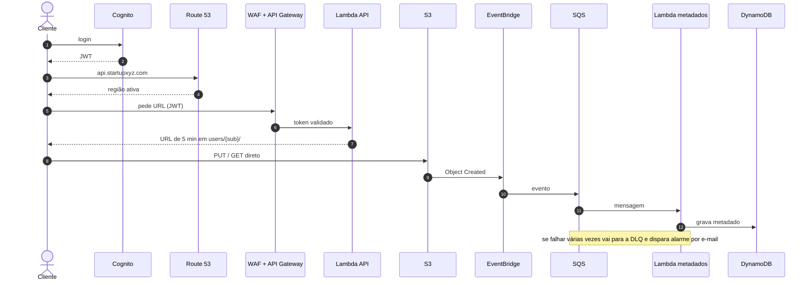

# Startup XYZ - Gestão de documentos para IA

Proposta de arquitetura da CAPS (Consultoria de Arquitetura, Preservação e Segurança) para a Startup XYZ.

TCC do curso AWS Re/Starter & No Code, Escola da Nuvem, turma BRSAO 253, Grupo 5.

Documentos da entrega:

- [TCC](docs/TCC_Startup_XYZ.docx)
- [Documento de arquitetura](docs/Arquitetura-Startup-XYZ.docx)
- [Apresentação](apresentacao/Apresentacao_XYZ.pptx)
- [Diagrama](arquitetura/arquitetura-startup-xyz.drawio)
- [Estimativas de custo](custos/)

## Contexto

A Startup XYZ tem um agente de IA que extrai dados de documentos enviados pelos clientes. Esses documentos não podem ser apagados, porque vão ser usados no treino dos próximos modelos.

Premissas que usamos:

- 50 mil arquivos novos por mês, 5 MB em média (250 GB/mês, 3 TB no fim do primeiro ano)
- 50 mil downloads por mês
- o cliente acessa o próprio arquivo por 12 meses
- depois de 365 dias o arquivo vai para a classe mais fria do S3
- nenhum arquivo é apagado pela aplicação

Também era preciso isolar um cliente do outro, aguentar a queda de uma AZ, ter uma região reserva e estimar o custo antes de implantar.

O case sugere como ponto de partida API Gateway, S3 e Lambda. Mantivemos os três e acrescentamos os serviços necessários para que o isolamento, a retenção, a falha de função e a perda de região fossem de fato resolvidos.

### Requisitos e onde são atendidos

| Requisito | Como foi resolvido |
|---|---|
| Isolar os clientes | Prefixo `users/{sub}/` montado na Lambda a partir do token do Cognito |
| Não apagar | Versionamento, Object Lock e bucket policy negando DELETE |
| Acesso por 1 ano | S3 Standard por 365 dias |
| Classe mais fria depois de 1 ano | Lifecycle para o Deep Archive |
| Queda de AZ | Serviços gerenciados em 3 AZs |
| Queda de região | Réplicas em us-west-2, failover no Route 53 e API recriada pelo CloudFormation |
| Falha de função | SQS com DLQ e alarme. O arquivo já está no S3 |
| Custo | Estimativa na Pricing Calculator e alerta no Budgets |

## Arquitetura


O fonte do diagrama está em [arquitetura/arquitetura-startup-xyz.drawio](arquitetura/arquitetura-startup-xyz.drawio) e abre no draw.io.

Legenda das setas:

- preta: requisição entre serviços
- verde tracejada: cliente acessando o S3 direto pela URL pré-assinada
- vermelha tracejada: caminho de falha (DLQ, alarme, e-mail)
- laranja tracejada: replicação entre regiões (S3 CRR, DynamoDB Global Tables, réplica do Cognito)
- roxa tracejada: failover de DNS no Route 53
- cinza: recursos que só existem depois do failover

Resumindo: serverless, região primária em us-east-1 (3 AZs) e us-west-2 em pilot light. O arquivo nunca passa pela API nem pela Lambda. A API só devolve uma URL pré-assinada e o cliente fala direto com o S3.

### Fluxo



1. O cliente faz login no Cognito e recebe o JWT.
2. Chama `api.startupxyz.com`. O Route 53 resolve para a região que está respondendo.
3. O WAF filtra a requisição e o API Gateway valida o token com o authorizer do Cognito.
4. A Lambda da API lê o `sub` do token, monta o prefixo `users/{sub}/` e devolve uma URL pré-assinada de 5 minutos. O prefixo nunca vem do app. A listagem dos arquivos do usuário sai do DynamoDB, pela mesma Lambda.
5. O cliente faz o upload ou o download direto no S3.
6. O S3 publica o `Object Created` no EventBridge, que manda para o SQS.
7. A Lambda de metadados consome a fila e grava no DynamoDB. Ela é idempotente, então reprocessar a mesma mensagem não duplica registro.

### Serviços

| Serviço | Uso |
|---|---|
| Route 53 | Registro de failover e health check em `/health` a cada 30s |
| Cognito User Pool | Login e JWT. Plano Essentials com réplica em us-west-2 |
| WAF | Web ACL regional na API e no Cognito, com rate limit e regras gerenciadas |
| Shield Standard | DDoS na borda (já vem ativo) |
| API Gateway (REST) | Authorizer do Cognito, throttling, domínio próprio. A rota `/health` não exige token, porque é o alvo do health check |
| Lambda (API) | Gera a URL pré-assinada e lista os arquivos do usuário. ARM |
| Lambda (metadados) | Consome o SQS e grava no DynamoDB. ARM, 256 MB |
| S3 | Bucket privado, só HTTPS, versionado, SSE-S3, Object Lock Governance de 7 anos, DELETE negado na bucket policy |
| S3 Lifecycle | Standard por 365 dias, depois Deep Archive |
| S3 CRR | Replica os objetos novos para us-west-2. O bucket de destino também é versionado e tem Object Lock. Os objetos antigos entram por Batch Replication |
| EventBridge | Recebe o evento de criação do bucket |
| SQS + DLQ | Desacopla o S3 da Lambda e segura a mensagem quando a função falha |
| DynamoDB | Índice dos arquivos. PK `userId` (o `sub`), on-demand, PITR, Global Tables |
| CloudWatch + SNS | Logs, métricas e alarme da DLQ por e-mail |
| CloudTrail | Trilha multi-região só de eventos de gerenciamento |
| KMS | Chave multi-região (primária e réplica), usada na criptografia do Cognito |
| IAM | A role da Lambda só tem acesso a `users/*`. O isolamento por usuário é feito no código, pelo `sub` |
| ACM | Certificado do domínio da API |
| Budgets | Alerta de custo |
| CloudFormation | Mesma infra nas duas regiões. A API do Oregon sobe por aqui no failover |

## Decisões

**URL pré-assinada em vez de mandar o arquivo pela Lambda.** O API Gateway aceita até 10 MB de payload e a Lambda síncrona até 6 MB. Passar o arquivo pela função também aumentaria o custo de execução, sem melhorar o isolamento.

**REST API em vez de HTTP API.** No API Gateway, o WAF só pode ser associado à REST API. Nesse volume a diferença de preço é de centavos.

**Deep Archive em vez de Glacier Instant Retrieval.** O case pede a classe mais fria, e Instant Retrieval não é. O restore em Bulk leva de 12 a 48h, o que serve para o treino. O cliente só acessa arquivos com menos de um ano.

**Lifecycle em vez de Intelligent-Tiering.** O Intelligent-Tiering move por acesso e o case pede por idade. Ele ainda cobra monitoramento por objeto.

**Object Lock em Governance, não Compliance.** Compliance não pode ser revertido por ninguém. Isso complicaria um pedido futuro de exclusão (LGPD, por exemplo).

**SQS entre o S3 e a Lambda.** Chamar a Lambda direto pelo evento funciona enquanto tudo dá certo. Com a fila, a mensagem fica esperando se a função cair e vai para a DLQ se continuar falhando.

**DynamoDB em vez de listar o prefixo no S3.** A tabela guarda o estado (ativo ou arquivado) e evita varrer o bucket a cada listagem.

**SSE-S3 em vez de SSE-KMS no objeto.** Nenhum requisito pede chave própria para os arquivos. O SSE-S3 já criptografa em repouso sem custo extra, enquanto o SSE-KMS acrescentaria chamadas cobradas ao KMS (menos com S3 Bucket Key, mas ainda assim um custo e uma chave a mais para gerenciar).

**CloudTrail sem data events.** Registrar cada leitura do S3 seria cobrado por request.

**us-east-1 em vez de São Paulo.** É mais barato e o case não exige que o dado fique no Brasil. Se exigir, muda a região e o desenho continua o mesmo.

**Pilot light em vez de active-active ou warm standby.** Manter a segunda região ligada duplicaria API, Lambda e WAF o tempo todo, e o case pede só uma região reserva.

## Disponibilidade e DR

Dentro da região, S3, Lambda, API Gateway, SQS e DynamoDB já rodam em 3 AZs. Não implantamos nada por zona.

Entre regiões o modelo é pilot light:

| | us-east-1 | us-west-2 |
|---|---|---|
| S3 | ativo | réplica (CRR) |
| DynamoDB | ativo | réplica (Global Tables) |
| Cognito | ativo | réplica |
| API Gateway, Lambdas, WAF | ativo | não existe até o failover |

Se a us-east-1 cair, os dados já estão no Oregon. A API de lá é criada pelo CloudFormation e o Route 53 passa a apontar para ela.

- **RPO:** minutos para os arquivos. A replicação do S3 é assíncrona, então o que estava sendo copiado na hora da falha pode faltar. Metadados (Global Tables) e usuários (réplica do Cognito) ficam quase em tempo real.
- **RTO:** horas. A subida da API secundária não é automática.

Outros cenários de falha:

- **Lambda da API fora:** o cliente não consegue link novo e tenta de novo. Os arquivos que já estão no S3 não são afetados.
- **Lambda de metadados fora:** a mensagem volta para a fila e, depois do `maxReceiveCount`, vai para a DLQ com alarme. O índice pode ser reconstruído a partir do prefixo no S3.
- **Uma AZ fora:** os serviços continuam nas outras duas.

## Escalabilidade

Nada é provisionado. API Gateway, Lambda, SQS e DynamoDB on-demand escalam com o uso e cobram por requisição.

Limites que olhamos:

- API Gateway: 10.000 req/s por conta/região (ajustável)
- Lambda: 1.000 execuções simultâneas por região (dá para pedir aumento)
- S3: 3.500 PUT e 5.500 GET por segundo por prefixo. Como cada usuário tem o seu prefixo, a carga se distribui.

O limite que mais preocupa é a concorrência da Lambda.

## Custo

Estimativa feita na AWS Pricing Calculator para as duas regiões, com preços de outubro de 2026. Premissas: 50 mil uploads e 50 mil downloads de 5 MB, 250 GB de saída e health check a cada 30s.

| Período | USD/mês |
|---|---:|
| Mês 1 | 60,53 |
| Mês 6 | 118,32 |
| Mês 12 | 187,68 |
| Mês 24 em diante | 199,63 |
| Total do ano 1 | 1.489,20 |

O custo para de crescer a partir do segundo ano. Todo mês entram 250 GB no Standard e saem 250 GB que completaram 365 dias. O Standard fica estável em 3 TB por região e só o Deep Archive cresce, a cerca de US$ 1 por TB por mês.

Quase toda a conta é S3 Standard nas duas regiões (cerca de US$ 138) mais a transferência de saída (US$ 22,50). Lambda, SQS e DynamoDB juntos ficam abaixo de US$ 3.

Um evento de desastre custa US$ 49,60, cobrado só no mês em que acontecer. Desse valor, US$ 38,84 são a restauração em Bulk de 3 TB, que só acontece se o treino precisar do acervo frio.

Os relatórios da calculadora estão em [custos/](custos/).

## Limitações

- Se a us-east-1 cair, o acesso fica fora por algumas horas. Os arquivos não se perdem.
- Durante o failover, o login funciona com o mesmo usuário e senha. Cadastro novo, troca de senha e MFA TOTP só voltam quando a região primária voltar, porque a réplica do Cognito não aceita escrita.
- O RPO não é zero.
- O WAF não inspeciona os arquivos, porque o upload vai direto para o S3.
- O CloudTrail não registra quem leu cada objeto.
- A exclusão a pedido do titular (LGPD) não pode ser feita pelo app. Ela depende de decisão jurídica e da permissão de bypass do Object Lock.
- Não há aplicação publicada. O trabalho cobre o desenho, as decisões e a estimativa de custo.

## Estrutura

```
docs/            TCC e documento de arquitetura
arquitetura/     diagrama (.drawio e .jpg)
apresentacao/    slides da apresentação
custos/          estimativas da AWS Pricing Calculator
```

## Equipe

Casthiel, Eliel, Evelyn, Kauan e Isac.

Orientador: Adriano Torres

## Referências

- [Managing the lifecycle of objects](https://docs.aws.amazon.com/AmazonS3/latest/userguide/object-lifecycle-mgmt.html)
- [Amazon S3 Glacier storage classes](https://docs.aws.amazon.com/AmazonS3/latest/userguide/glacier-storage-classes.html)
- [Using S3 Object Lock](https://docs.aws.amazon.com/AmazonS3/latest/userguide/object-lock.html)
- [Replicating objects](https://docs.aws.amazon.com/AmazonS3/latest/userguide/replication.html)
- [AWS Pricing Calculator](https://calculator.aws)
