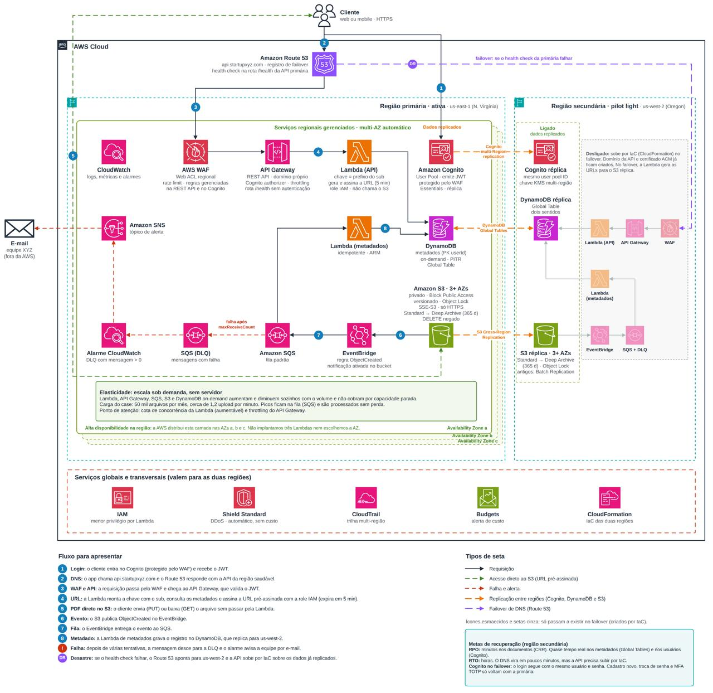
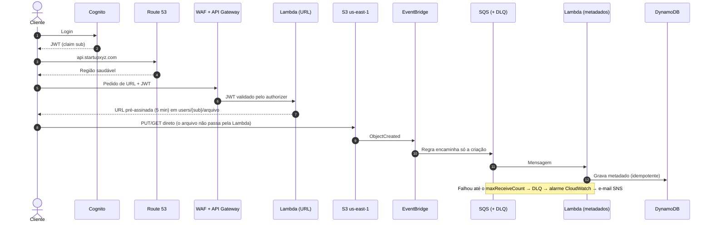

# CAPS · Gestão de Documentos para IA — Startup XYZ

> **CAPS — Consultoria de Arquitetura, Preservação e Segurança**
> Proposta de arquitetura serverless na AWS para a **Startup XYZ**: guardar todo o acervo de documentos dos clientes como base de treino de IA, sem que o armazenamento permanente torne o negócio inviável.


Trabalho de conclusão do curso **AWS Re/Starter & No Code** — Escola da Nuvem, turma **BRSAO 253** · Grupo 5 · 2026

---

## Sumário

- [O desafio](#o-desafio)
- [A solução em uma frase](#a-solução-em-uma-frase)
- [Diagrama da arquitetura](#diagrama-da-arquitetura)
- [Fluxo de um documento](#fluxo-de-um-documento)
- [Serviços e responsabilidades](#serviços-e-responsabilidades)
- [Requisitos × onde são atendidos](#requisitos--onde-são-atendidos)
- [Decisões de arquitetura e alternativas descartadas](#decisões-de-arquitetura-e-alternativas-descartadas)
- [Alta disponibilidade e recuperação de desastre](#alta-disponibilidade-e-recuperação-de-desastre)
- [Escalabilidade](#escalabilidade)
- [Estimativa de custo](#estimativa-de-custo)
- [Limites assumidos](#limites-assumidos)
- [Estrutura do repositório](#estrutura-do-repositório)
- [Equipe](#equipe)

---

## O desafio

A Startup XYZ lançou um agente de IA que extrai dados de documentos enviados pelos próprios clientes (modelo SaaS). Esse acervo é o ativo de treinamento dos próximos modelos.

| Premissa | Valor |
|---|---|
| Arquivos novos por mês | **50 mil** (PDFs e imagens) |
| Tamanho médio | **5 MB** → **250 GB/mês** → **3 TB** ao fim do 1º ano |
| Downloads por mês | 50 mil (250 GB de saída) |
| Acesso do cliente | **12 meses** após o envio |
| Exclusão de arquivos | **Nenhuma** no fluxo da aplicação |
| Após 365 dias | Mover para a **camada de armazenamento mais fria** |

Requisitos não funcionais: isolamento total entre clientes, tolerância à queda de uma zona de disponibilidade, região reserva para desastre, elasticidade e custo estimado antes da implantação.

## A solução em uma frase

O cliente se autentica no **Cognito**, pede uma **URL pré-assinada** à API, envia o arquivo **direto ao S3**, e um fluxo assíncrono (**EventBridge → SQS → Lambda**) registra os metadados no **DynamoDB**. No dia 365 o **Lifecycle** move o objeto para o **Glacier Deep Archive**. Tudo é replicado para **us-west-2** e nada é apagado.

## Diagrama da arquitetura



> Arquivo-fonte editável: [`arquitetura/arquitetura-startup-xyz.drawio`](arquitetura/arquitetura-startup-xyz.drawio) (abrir em [app.diagrams.net](https://app.diagrams.net)).

**Legenda das setas**

| Seta | Significado |
|---|---|
| Preta contínua | Requisição entre serviços |
| Verde tracejada | Acesso direto do cliente ao S3 via URL pré-assinada |
| Vermelha tracejada | Caminho de falha e alerta (DLQ → alarme → e-mail) |
| Laranja tracejada | Replicação entre regiões (S3 CRR, DynamoDB Global Tables, Cognito multi-Region) |
| Roxa tracejada | Failover de DNS pelo Route 53 |
| Cinza contínua | Ligação que só passa a existir no failover (criada pelo CloudFormation) |

## Fluxo de um documento



## Serviços e responsabilidades

Cada serviço tem **um único trabalho**.

| Camada | Serviço | Papel na solução |
|---|---|---|
| Entrada | **Amazon Route 53** | Um único endereço (`api.startupxyz.com`), registro de failover e health check HTTPS em `/health` a cada 30 s |
| Identidade | **Amazon Cognito User Pool** | Login e JWT. O `sub` do token vira o prefixo do usuário no S3. Plano Essentials com réplica multi-região |
| Proteção | **AWS WAF** | Web ACL regional na REST API e no Cognito (regra de taxa + grupo gerenciado). Não inspeciona o PDF |
| Proteção | **AWS Shield Standard** | DDoS na borda, sem custo |
| API | **Amazon API Gateway (REST)** | Authorizer do Cognito, throttling, domínio próprio, rota `/health` sem autenticação |
| Processamento | **AWS Lambda — URL** (ARM) | Só assina: lê o `sub`, monta o prefixo, devolve PUT/GET válido por 5 min |
| Processamento | **AWS Lambda — metadados** (ARM, 256 MB) | Consome a fila e grava o índice de forma idempotente |
| Armazenamento | **Amazon S3** | Privado, Block Public Access, só HTTPS, versionado, SSE-S3, Object Lock (Governance, 7 anos), DELETE negado na policy. Lifecycle: Standard 365 dias → Deep Archive |
| Armazenamento | **S3 Cross-Region Replication** | Cada objeto novo vai para us-west-2 em minutos. Legado entra por Batch Replication |
| Integração | **Amazon EventBridge** | Recebe `ObjectCreated` do bucket e encaminha ao SQS |
| Integração | **Amazon SQS + DLQ** | Absorve picos; mensagem volta à fila se a função falhar; esgotadas as tentativas, vai à DLQ |
| Índice | **Amazon DynamoDB** | Partition key `userId` (= `sub`), on-demand, PITR, Global Tables para o Oregon |
| Observabilidade | **CloudWatch + SNS** | Métricas, logs e alarme da DLQ enviado por e-mail |
| Governança | **CloudTrail** | Trilha multi-região de eventos de gerenciamento |
| Governança | **IAM** | Menor privilégio: a role só alcança o prefixo que a própria função calculou |
| Governança | **AWS Budgets** | Alerta de teto de custo |
| Segurança | **AWS KMS** | Chave multi-região (primária + réplica) |
| Segurança | **ACM** | Certificado público do domínio da API |
| Automação | **AWS CloudFormation** | As duas regiões nascem do mesmo código; a API do Oregon sobe daqui no failover |

## Requisitos × onde são atendidos

| Requisito | Como a arquitetura responde |
|---|---|
| Isolar o cliente | Prefixo = `sub` do token, calculado na Lambda — nunca um campo enviado pelo app |
| Não apagar | Versionamento + Object Lock Governance + policy negando DELETE |
| Esfriar no dia 365 | S3 Lifecycle por idade → Glacier Deep Archive |
| Queda de zona | Serviços gerenciados já são multi-AZ (3 zonas) |
| Queda de região | Réplicas no Oregon + failover pelo Route 53 + API via CloudFormation |
| Falha de função | Fila + DLQ + alarme; o PDF já está no S3 |
| Custo visível | AWS Pricing Calculator + AWS Budgets |

## Decisões de arquitetura e alternativas descartadas

| Decisão | Alternativa descartada | Motivo |
|---|---|---|
| Upload/download por **URL pré-assinada** | Arquivo passando pela Lambda | Limite de 10 MB no API Gateway e 6 MB na Lambda síncrona; mais custo de duração; nenhum ganho de isolamento |
| **REST API** | HTTP API | O WAF regional só se associa à REST; diferença de preço de centavos neste volume |
| **Deep Archive** | Glacier Instant Retrieval | Instant Retrieval não é a classe mais fria pedida pelo case |
| **Lifecycle por idade** | Intelligent-Tiering | Move por acesso, não por idade, e cobra monitoramento por objeto |
| **Object Lock Governance** | Compliance | Compliance é irreversível e inviabilizaria um pedido futuro (ex.: LGPD) |
| **SQS + DLQ** | Lambda invocada direto pelo evento do S3 | Sem fila, não há onde a mensagem esperar quando a função está em erro |
| **DynamoDB** como índice | Listar o prefixo do S3 a cada consulta | Perde o estado (ativo/arquivado) e exige varrer o bucket |
| **Pilot light** | Active-active / warm standby | Duplicaria API, Lambda e WAF com custo permanente que o case não pede |
| **SSE-S3** no objeto | SSE-KMS por objeto | KMS cobraria request em cada um dos 50 mil downloads |
| **CloudTrail sem data events** | Registrar cada leitura do S3 | Cobrado por request; o acesso já é controlado pela URL assinada |
| **us-east-1** | sa-east-1 (São Paulo) | Preço menor e o case não fixa país; a troca seria de região, não de desenho |

## Alta disponibilidade e recuperação de desastre

**Nível 1 — dentro da região:** S3, Lambda, API Gateway, SQS e DynamoDB já se distribuem por três zonas de disponibilidade. Não há máquina para religar.

**Nível 2 — entre regiões (pilot light em us-west-2):**

| Componente | us-east-1 (primária) | us-west-2 (secundária) |
|---|---|---|
| S3 (arquivos) | Ativo | **Ligado** — réplica via CRR |
| DynamoDB (índice) | Ativo | **Ligado** — Global Tables |
| Cognito (usuários) | Ativo | **Ligado** — multi-Region replication |
| API Gateway, Lambdas, WAF | Ativo | **Desligado** — sobe via CloudFormation no failover |

| O que cai | O que acontece |
|---|---|
| Lambda da URL | O cliente não recebe link novo e tenta de novo; o PDF continua no S3 |
| Lambda de metadados | A mensagem volta à fila; no limite vai à DLQ e o alarme envia e-mail. O índice pode ser reconstruído pelo prefixo |
| Uma zona | A execução segue nas outras |
| A região | O arquivo já está no Oregon; o Route 53 vira o DNS e a API sobe do CloudFormation |

| Meta | Valor | Observação |
|---|---|---|
| **RPO** | Minutos | Replicação assíncrona: o que estava em trânsito pode faltar |
| **RTO** | Horas | DNS vira e a API reserva é criada deliberadamente |
| Restore do acervo frio | 12 a 48 h (Bulk) | Só para treino; o cliente acessa apenas o último ano |

## Escalabilidade

A arquitetura cresce com o arquivo, não com servidor: API Gateway, Lambda e DynamoDB on-demand cobram por uso, o S3 não tem teto de capacidade e a fila absorve picos de eventos.

| Serviço | Limite de referência |
|---|---|
| API Gateway | 10.000 req/s por conta e região (ajustável) |
| Lambda | 1.000 execuções simultâneas por região (cota aumentável) |
| S3 | 3.500 escritas e 5.500 leituras por segundo **por prefixo** — como cada usuário tem o próprio prefixo, a carga se espalha |

**Ponto de atenção:** a cota de concorrência da Lambda na conta.

## Estimativa de custo

Valores da AWS Pricing Calculator (us-east-1 + us-west-2), com 50 mil uploads, 50 mil downloads, 5 MB por arquivo, 250 GB de saída e health check a cada 30 s. **Nenhum serviço do desenho foi retirado da conta.**

| Período | Custo mensal (USD) |
|---|---:|
| Mês 1 | ~60,53 |
| Mês 6 | 118,32 |
| Mês 12 | **187,68** |
| **Soma do ano 1** (meses 1 a 12) | **1.489,20** |
| Mês 24 em diante | **199,63** |
| Desastre (pontual, fora da fatura) | 49,60 — dos quais 38,84 só se houver restore Bulk de 3 TB |

**Por que a conta estabiliza?** Todo mês entram 250 GB no Standard e saem 250 GB que completaram 365 dias. A janela quente fica fixa em **3 TB por região**; o que cresce é o Deep Archive, a ~US$ 1 por TB/mês.

**Onde está o dinheiro (mês 24):** os dois S3 Standard (~US$ 138) e a saída para a internet (US$ 22,50). Lambda, SQS e DynamoDB juntos ficam abaixo de US$ 3.

Detalhamento por serviço em [`custos/`](custos/).

## Limites assumidos

- A queda da região primária interrompe o acesso por **horas**, até a API secundária subir — o arquivo não se perde.
- RPO **não é zero**: objetos em trânsito no momento da falha podem faltar na réplica.
- O WAF protege a API e o login, mas **não inspeciona o PDF** (que vai direto ao S3 pela URL assinada).
- A trilha do CloudTrail não registra cada leitura de objeto (decisão de custo).
- Exclusão por LGPD **não é um clique no app**: exige decisão jurídica e permissão de bypass, fora do fluxo da aplicação.
- **Não há aplicação publicada.** Esta entrega demonstra a decisão de arquitetura, o desenho e a estimativa.

## Estrutura do repositório

```
consultoria-startup-xyz/
├── README.md
├── docs/
│   ├── TCC_Startup_XYZ.docx              # Trabalho completo (ABNT)
│   └── Arquitetura-Startup-XYZ.docx      # Documento técnico da arquitetura
├── arquitetura/
│   ├── arquitetura-startup-xyz.drawio    # Diagrama editável
│   └── arquitetura-startup-xyz.jpg       # Diagrama exportado
├── apresentacao/
│   └── Apresentacao_XYZ.pptx             # Deck para a banca (15 slides)
└── custos/
    ├── 01-ano1-meses-01-a-11.pdf
    ├── 02-ano1-mes-12.pdf
    ├── 03-ano2-em-diante.pdf
    └── 04-desastre-e-recuperacao.pdf
```

## Equipe

**CAPS — Consultoria de Arquitetura, Preservação e Segurança** · Grupo 5

| Integrante |
|---|
| Casthiel |
| Eliel |
| Evelyn |
| Kauan |
| Isac |

**Orientador:** Adriano Torres
**Curso:** AWS Re/Starter & No Code — Escola da Nuvem, turma BRSAO 253

### Referências

- [Amazon S3 — Managing the lifecycle of objects](https://docs.aws.amazon.com/AmazonS3/latest/userguide/object-lifecycle-mgmt.html)
- [Amazon S3 Glacier storage classes](https://docs.aws.amazon.com/AmazonS3/latest/userguide/glacier-storage-classes.html)
- [Using S3 Object Lock](https://docs.aws.amazon.com/AmazonS3/latest/userguide/object-lock.html)
- [Replicating objects](https://docs.aws.amazon.com/AmazonS3/latest/userguide/replication.html)
- [AWS Pricing Calculator](https://calculator.aws)
